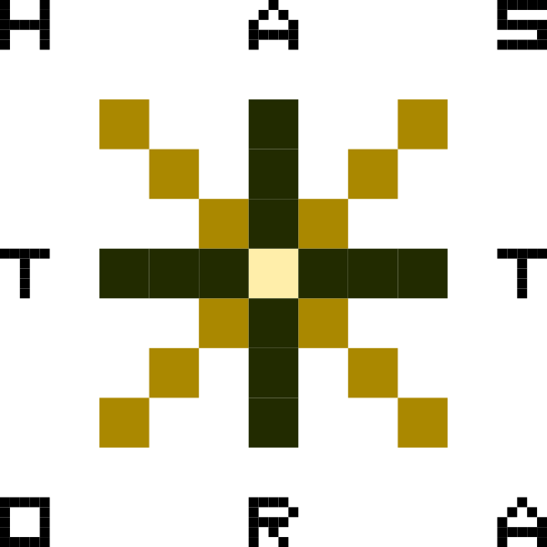

# Astaroth - A Multi-GPU library for generic stencil computations

Astaroth is a single-node multi-GPU library for multiphysics and other problems, which involve stencil computations in a discrete mesh. It's licenced under the terms of the GNU General Public Licence, version 3, or later (see [LICENCE.txt](https://bitbucket.org/miikkavaisala/astaroth-code/src/master/astaroth_2.0/LICENCE.txt)). Astaroth ships with a domain-specific language, that can be used to translate high-level representation of the stencil computations into a heavily inlined GPU pipeline.

## System requirements

NVIDIA GPU with >= 3.0 compute capability. See https://en.wikipedia.org/wiki/CUDA#GPUs_supported.

## Building (3rd party libraries)

1. `cd 3rdparty`
1. `./setup_dependencies.sh` Note: this may take some time.

## Building (Astaroth 2.0)

1. `cd astaroth_2.0/build`
1. `cmake -DDOUBLE_PRECISION=OFF -DBUILD_DEBUG=OFF ..` (Use `cmake -D CMAKE_C_COMPILER=icc -D CMAKE_CXX_COMPILER=icpc -DDOUBLE_PRECISION=OFF -DBUILD_DEBUG=OFF ..` if compiling on TIARA)
1. `../scripts/compile_acc.sh && make -j`
1. `./ac_run <options>`

If you encounter issues, recheck that the 3rd party libraries were successfully built during the previous step.

### Available options

- `-s` simulation
- `-b` benchmark
- `-t` automated test (NOTE! This is expected to fail with the default configuration as there's no CPU model solution for forcing/entropy)

By default, the program does a real-time visualization of the simulation domain. The camera and the initial conditions can be controller by `arrow keys`, `pgup`, `pgdown` and `spacebar`.

## Generating documentation

Run `doxygen doxyfile` in astaroth_2.0 directory. The generated files can be found in `doc/doxygen`. The main page of the documentation will be at `dox/doxygen/astaroth_doc_html/index.html`.

## Formatting

If you have clang-format, you may run `scripts/fix_style.sh`. This script will recursively fix style of all the source files down from the current working directory. The script will ask for a confirmation before making any changes. 

## Directory structure

## Coding style.

### In a nutshell
- Use [K&R indentation style](https://en.wikipedia.org/wiki/Indentation_style#K&R_style) and 4 space tabs. 
- Line width is 100 characters
- Start function names after a linebreak in source files. 
- [Be generous with `const` type qualifiers](https://isocpp.org/wiki/faq/const-correctness). 
- When in doubt, see [Google C++ Style Guide](https://google.github.io/styleguide/cppguide.html).

### Header example:
```cpp
// Licence notice and doxygen description here
#pragma once
#include "avoid_including_headers_here.h"

/** Doxygen comments */
void globalFunction(void);
```


### Source example:
```cpp
#include "parent_header.h"

#include <standard_library_headers.h>

#include "other_headers.h"
#include "more_headers.h"

typedef struct {
	int data;
} SomeStruct;

static inline int small_function(const SomeStruct& stuff) { return stuff.data; }

// Pass constant structs always by reference (&) and use const type qualifier.
// Modified structs are always passed as pointers (*), never as references.
// Constant parameters should be on the left-hand side, while non-consts go to the right.
static void
local_function(const SomeStruct& constant_struct, SomeStruct* modified_struct)
{
	modified_struct->data = constant_struct.data;
}

void
globalFunction(void)
{
	return;
}
```
## Miikka's compilation notes

Modules Modules usen when compiling when compiling

  * intel/2016                         
  * hdf5/1.8.16_openmpi_1.10.2_ic16.0   
  * cmake/3.9.5
  * openmpi/1.10.2_ic16.0               
  * gcc/5.3.0
  * cuda/9.0

Requires this gcc flag to compile: `-mno-bmi2` Otherwise you get assembler error! 

For stencil pre-processing `flex` and particularly `libfl` is required for `acc/code_generator.c` to compile. 

Need CUDA version 9.2 or above version. 

Comment out cudaGetDeviceCount(&num_devices) in astaroth.cu 

OLD: `astaroth_2.0/acc/build.sh` only work when each line is written individually. (**solution needed**)

  
(**These are here because I don't dare to delete them yet** OLD: Intel compiler does not get correct flags with cmake on default settings. 
This worked with 1.0: `cmake -D CMAKE_C_COMPILER=icc -D CMAKE_CXX_COMPILER=icpc -DDOUBLE_PRECISION=OFF -DBUILD_DEBUG=OFF ..` 
but not this time. Issue with calling c+11 + definin compiler flags correctly in nvcc. 

OLD: I need to put `-I/software/opt/cuda/9.0/include` into the ../CMakeLists.txt so that it compiles. )
